# AI Mentor 🧠✨

AI Mentor is a full-stack, AI-powered habit tracker and daily reflection application. It acts as a personal digital mentor, combining daily habit tracking with gamification and AI-driven insights to help users stay consistent, motivated, and reflective about their daily progress.

## 🌟 Features

* **Smart Habit Tracking:** Easily add, toggle, and track daily habits.
* **AI-Powered Daily Reflections:** Generates personalized daily reflections and motivational advice using Google Generative AI & OpenAI based on your habit completion streak.
* **Gamification Engine:** Earn XP, level up, and maintain streaks by completing habits and daily reflections. 
* **Weekly Intelligence:** Receive AI-generated weekly performance reviews breaking down consistency, strengths, weaknesses, and an action plan.
* **Data Visualization:** Track your emotional and productivity trends with interactive charts.
* **Secure Authentication:** Full JWT-based user authentication and protected routes.

---

## 🏗️ Software Architecture

The application follows a decoupled Client-Server architecture, utilizing the MERN stack alongside external AI cloud services. 

```mermaid
graph TD
    subgraph "Client Tier (Frontend)"
        UI[React 19 UI]
        Context[React Context State]
        Router[React Router v7]
        API_Client[API Services / Fetch]
        
        UI --> Context
        UI --> Router
        Router --> API_Client
    end

    subgraph "Application Tier (Backend)"
        Express[Express.js Server]
        Auth[JWT Auth Middleware]
        Controllers[Business Logic / Controllers]
        Prompts[AI Prompt Engine]
        
        API_Client -->|REST API over HTTP| Auth
        Auth --> Express
        Express --> Controllers
        Controllers --> Prompts
    end

    subgraph "Data Tier"
        Mongo[(MongoDB)]
        Mongoose[Mongoose ODM]
        
        Controllers <--> Mongoose
        Mongoose <--> Mongo
    end

    subgraph "External AI Services"
        Gemini[Google Gemini API]
        OpenAI[OpenAI API]
        
        Prompts <--> Gemini
        Prompts <--> OpenAI
    end
```



### Architecture Breakdown
1. **Presentation Layer (Frontend):** Built with React 19 and Vite. State is managed globally via the Context API (`AuthContext`, `HabitContext`, `UserStatsContext`). The UI utilizes Tailwind CSS v4 for styling and Recharts for data visualization.
2. **Business Logic Layer (Backend):** A Node.js/Express.js RESTful API. It handles user authentication via JWT, rate limiting, and core business logic (gamification rules, habit toggling). 
3. **AI Proxy Layer:** The backend securely holds the API keys and proxies requests to Google Gemini and OpenAI. It injects dynamic user context (streaks, habit completion rates, previous reflections) into structured prompts before sending them to the LLMs.
4. **Data Access Layer:** MongoDB Atlas (or local MongoDB) is accessed via Mongoose ODM, utilizing structured schemas for `Users`, `Habits`, `Chats`, and `Reflections`.

---

## 🛠️ Tech Stack

**Frontend**
* **Framework:** [React 19](https://react.dev/) powered by [Vite](https://vitejs.dev/)
* **Routing:** React Router v7
* **Styling:** [Tailwind CSS v4](https://tailwindcss.com/) with Glassmorphism UI
* **Animations:** [Framer Motion](https://www.framer.com/motion/)
* **Charts:** [Recharts](https://recharts.org/)
* **Icons:** Lucide React

**Backend**
* **Runtime:** [Node.js](https://nodejs.org/) (ES Modules)
* **Framework:** [Express.js](https://expressjs.com/)
* **Database:** [MongoDB](https://www.mongodb.com/) via Mongoose
* **AI Integration:** `@google/generative-ai` & `openai` SDKs
* **Security:** `jsonwebtoken` (JWT), `bcryptjs`, `express-rate-limit`, `cors`

---

## 🚀 Getting Started

### Prerequisites
Make sure you have the following installed on your machine:
* [Node.js](https://nodejs.org/en/download/) (v18 or higher recommended)
* [MongoDB](https://www.mongodb.com/try/download/community) (Local instance or MongoDB Atlas URI)

### 1. Clone the Repository
```bash
git clone [https://github.com/yourusername/ai-mentor.git](https://github.com/yourusername/ai-mentor.git)
cd ai-mentor
```

### 2. Backend Setup
Navigate to the backend directory, install dependencies, and set up your environment variables.
```bash
cd backend
npm install
```

Create a `.env` file in the `backend` root and add the following variables:
```env
PORT=5000
MONGO_URI=your_mongodb_connection_string
JWT_SECRET=your_super_secret_jwt_key
JWT_EXPIRES_IN=30d
GEMINI_API_KEY=your_google_gemini_api_key
OPENAI_API_KEY=your_openai_api_key
```

Start the backend development server:
```bash
npm run dev
```

### 3. Frontend Setup
Open a new terminal window, navigate to the frontend directory, and install dependencies.
```bash
cd frontend
npm install
```

Start the frontend Vite development server:
```bash
npm run dev
```

---

## 📂 Project Structure

```text
ai-mentor/
├── backend/                # Express.js backend
│   ├── src/
│   │   ├── config/         # Database and AI configuration
│   │   ├── controllers/    # Route controllers (auth, habits, reflections)
│   │   ├── middleware/     # Custom middleware (auth, rate limiting)
│   │   ├── models/         # Mongoose schemas (User, Habit, Reflection)
│   │   ├── prompts/        # AI system prompts
│   │   ├── routes/         # Express API routes
│   │   └── services/       # External API services (Gemini/OpenAI)
│   └── package.json
└── frontend/               # React (Vite) frontend
    ├── src/
    │   ├── components/     # Reusable UI components (Chat, Dashboard, Shared)
    │   ├── context/        # React Context (Auth, Habits, Stats)
    │   ├── layout/         # App layouts (Navbar, Sidebar)
    │   ├── pages/          # Full page components (Dashboard, Login, Chat)
    │   ├── services/       # API integration functions
    │   └── utils/          # Utility functions (Tailwind class merging)
    └── package.json
```

---

## 📝 Scripts

### Backend (`/backend`)
* `npm run dev`: Starts the server in development mode using Node.

### Frontend (`/frontend`)
* `npm run dev`: Starts the Vite development server.
* `npm run build`: Builds the app for production to the `dist` folder.
* `npm run lint`: Runs ESLint to check for code quality.

---

## 📄 License
This project is licensed under the ISC License.

## 👤 Author
Developed by **deep**